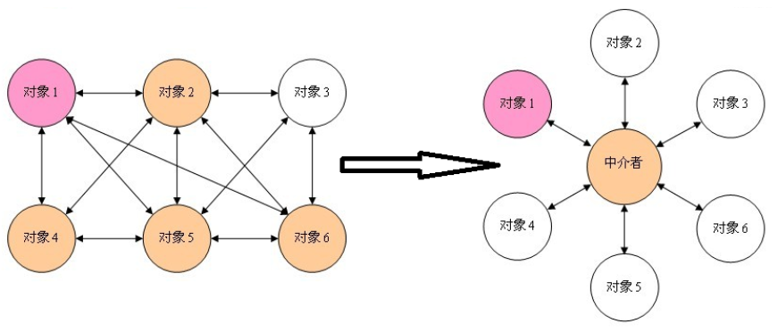
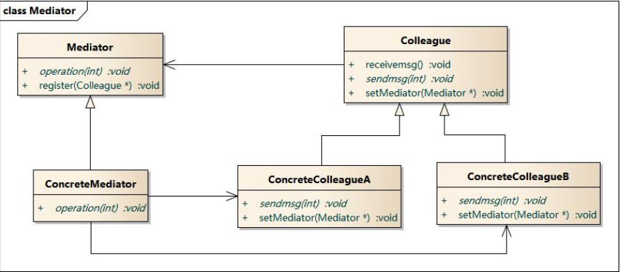

### 中介者模式

------

> 1. 动机：
>
>    * 系统结构复杂：对象之间存在大量的相互关联和调用，若有一个对象发生变化，则需要跟踪和该对象关联的其他所有对象，并进行适当处理
>    * 对象可重用性差：由于一个对象和其他对象具有很强的关联，若没有其他对象的支持，一个对象很难被另一个系统或模块重用，这些对象表现出来更像一个不可分割的整体，职责较为混乱。
>    * 系统扩展性低：增加一个新的对象需要在原有相关对象上增加引用，增加新的引用关系也需要调整原有对象，系统耦合度很高，对象操作很不灵活，扩展性差。
>    * 在面向对象的软件设计与开发过程中，根据“单一职责原则”，我们应该尽量将对象细化，使其只负责或呈现单一的职责。
>    * 对于一个模块，可能由很多对象构成，而且这些对象之间可能存在相互的引用，为了减少对象两两之间复杂的引用关系，使之成为一个松耦合的系统，我们需要使用中介者模式，这就是中介者模式的模式动机。
>
> 2. 定义：
>
>    用一个中介者对象来封装一系列的对象交互，中介者使各对象不需要显示地相互引用，从而使得其耦合松散，而且可以独立地改变他们之间的交互。
>
>    

>  	GOF 定义UML:
>
> 

> 3. 优点：
>
>    * 简化了对象之间的交互。
>    * 将各同事解耦。
>    * 减少子类生成。
>    * 可以简化各同事类的设计和实现。
>
> 4. 确定：
>
>    在具体中介者类中包含了同事之间的交互细节，可能会导致具体中介者类非常复杂，使得系统难以维护。
>
> 5. 总结：
>
>    * 中介者模式用一个中介对象来封装一系列的对象交互，中介者使各对象不需要显式地相互引用，从而使其耦合松散，而且可以独立地改变它们之间的交互。中介者模式又称为调停者模式，它是一种对象行为型模式。
>    * 中介者模式包含四个角色：抽象中介者用于定义一个接口，该接口用于与各同事对象之间的通信；具体中介者是抽象中介者的子类，通过协调各个同事对象来实现协作行为，了解并维护它的各个同事对象的引用；抽象同事类定义各同事的公有方法；具体同事类是抽象同事类的子类，每一个同事对象都引用一个中介者对象；每一个同事对象在需要和其他同事对象通信时，先与中介者通信，通过中介者来间接完成与其他同事类的通信；在具体同事类中实现了在抽象同事类中定义的方法。
>    * 通过引入中介者对象，可以将系统的网状结构变成以中介者为中心的星形结构，中介者承担了中转作用和协调作用。中介者类是中介者模式的核心，它对整个系统进行控制和协调，简化了对象之间的交互，还可以对对象间的交互进行进一步的控制。
>    * 中介者模式的主要优点在于简化了对象之间的交互，将各同事解耦，还可以减少子类生成，对于复杂的对象之间的交互，通过引入中介者，可以简化各同事类的设计和实现；中介者模式主要缺点在于具体中介者类中包含了同事之间的交互细节，可能会导致具体中介者类非常复杂，使得系统难以维护。
>    * 中介者模式适用情况包括：系统中对象之间存在复杂的引用关系，产生的相互依赖关系结构混乱且难以理解；一个对象由于引用了其他很多对象并且直接和这些对象通信，导致难以复用该对象；想通过一个中间类来封装多个类中的行为，而又不想生成太多的子类。